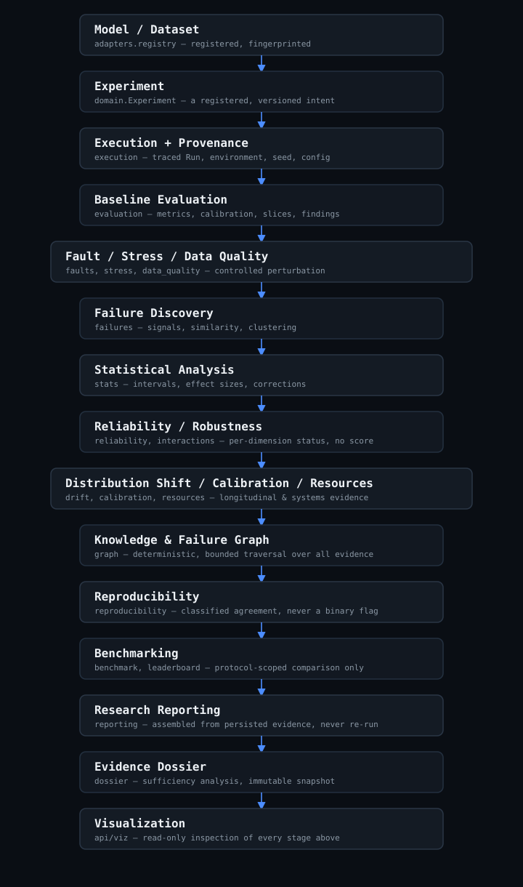
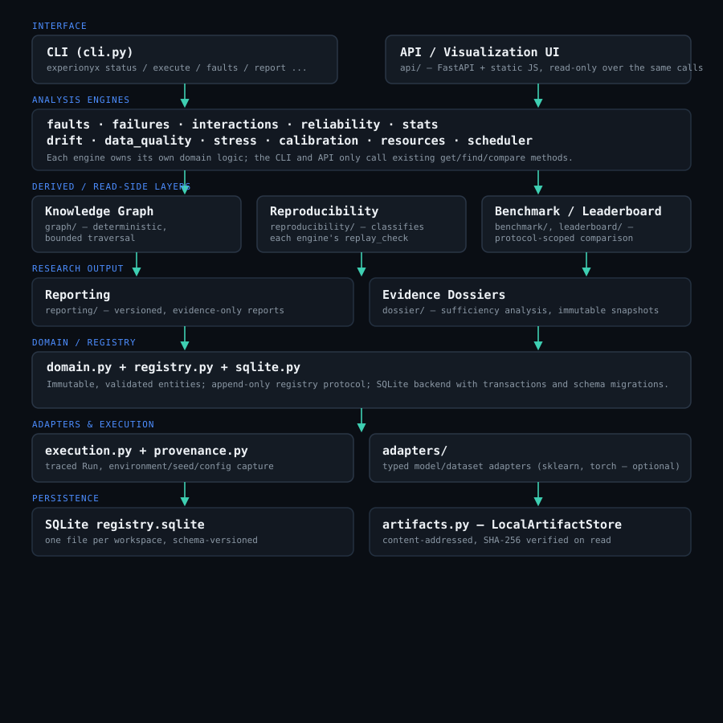
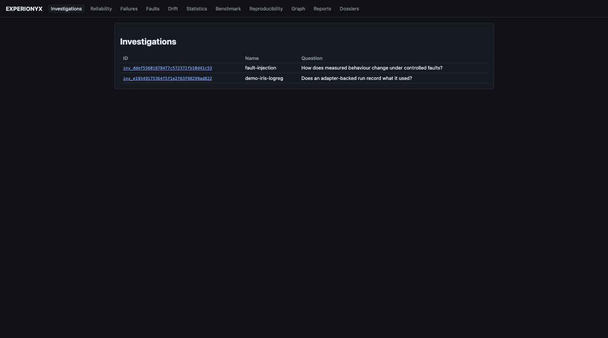
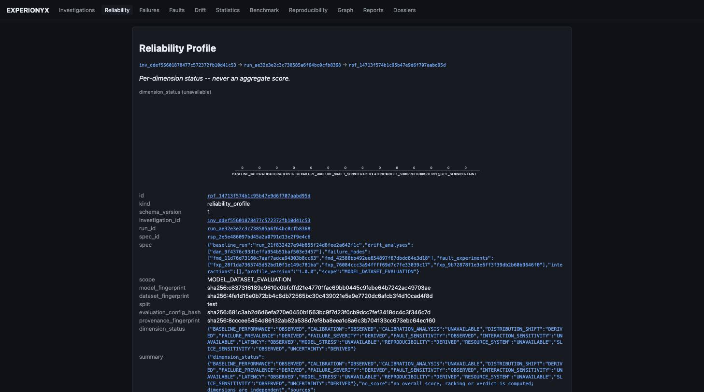
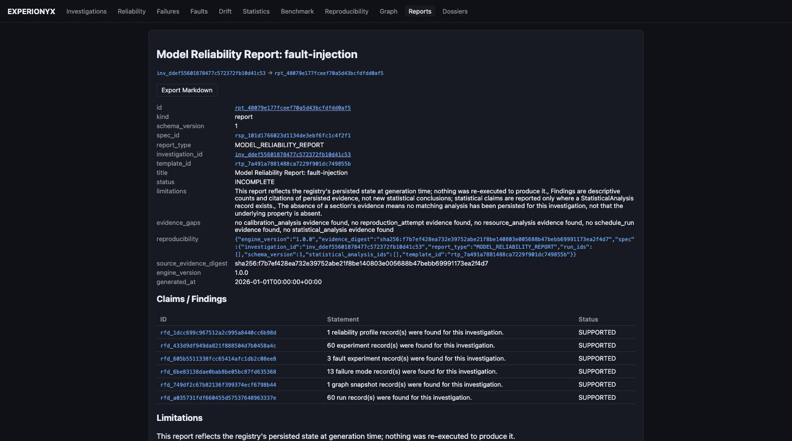
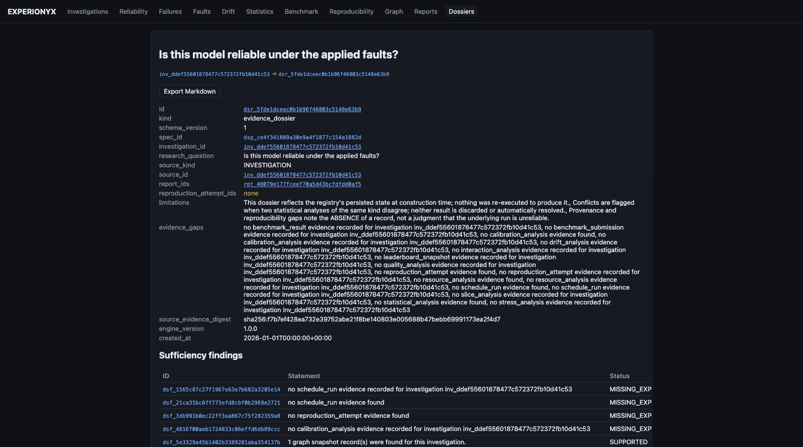

<p align="center">
  
</p>

<p align="center">
  <a href="https://github.com/soyebmohammad03-dev/EXPERIONYX/actions/workflows/ci.yml"></a>
  
  <a href="LICENSE"></a>
  
</p>

An evidence-driven laboratory for controlled experimentation, failure discovery, statistical
analysis, reproducibility, provenance, benchmarking, and reliability analysis of AI/ML systems —
every result traceable back to a real run, not asserted from a single lucky seed.

> Every subsystem below is implemented, tested, and reachable both from the CLI and from a
> read-only HTTP API + vanilla-JS UI (`experionyx viz serve`). See [docs/roadmap.md](docs/roadmap.md)
> for phase history and [docs/limitations.md](docs/limitations.md) for what is genuinely bounded.

## Why EXPERIONYX exists

AI/ML results are routinely reported from a single seed, a single run, and an unrecorded
environment. Failure modes are found anecdotally, reproducibility is assumed rather than measured,
and conclusions are rarely traceable to observations.

EXPERIONYX is built around the complete evidence lifecycle rather than around tracking metrics:

```
experiment → controlled perturbation → failure discovery → statistical analysis
  → reliability analysis → provenance → reproducibility → evidence graph
  → research report → evidence dossier
```

This is a different focus than a conventional experiment tracker: EXPERIONYX does not just log
metrics from your training runs, it actively perturbs a model/dataset under controlled faults,
discovers and clusters failures, tests whether effects are statistically real, and keeps every
resulting claim linked back to the evidence it came from. It does not aim to replace general MLOps
platforms — it is a research instrument for reliability, not a training or deployment pipeline.

## What EXPERIONYX does

- **Experiment & provenance** — traced runs with recorded environment, seed, configuration, and
  content-addressed artifacts.
- **Controlled perturbation** — fault injection, model stress, and data-quality checks, all
  seeded and replayable.
- **Failure discovery** — normalized failure signals, interpretable clustering, and a validated
  discovery-to-confirmation lifecycle.
- **Statistical analysis** — bootstrap intervals, effect sizes, permutation tests, and explicit
  multiple-comparison correction.
- **Reliability & robustness** — a ten-dimension, evidence-first reliability profile. No composite
  score, no ranking, no "best model" verdict — see [docs/reliability.md](docs/reliability.md).
- **Distribution shift, calibration, resources** — longitudinal drift, probability calibration,
  and systems/resource measurements, each with explicit uncertainty.
- **Knowledge & failure graph** — a deterministic, bounded-traversal graph over every entity above.
- **Reproducibility** — a classification (EXACT / DETERMINISTIC / NUMERIC_TOLERANCE / STATISTICAL /
  PROVENANCE_ONLY) of how well a result reproduces — never a single pass/fail flag.
- **Benchmarking** — protocol-scoped comparisons with reproducibility and resource context kept
  separate from predictive metrics.
- **Research reporting & evidence dossiers** — versioned artifacts assembled entirely from
  already-persisted evidence; a claim without a resolvable evidence reference cannot exist.
- **Visualization** — a read-only FastAPI + vanilla-JS UI over every result above.

Full capability-by-capability detail: [docs/README.md](docs/README.md).

## Research lifecycle

<p align="center">
  
</p>

Every stage persists evidence the next stage reads; nothing downstream re-executes an experiment or
recomputes a statistic. `examples/end_to_end_workflow.py` runs this exact sequence against real
(small, deterministic) data — no mocks.

## Architecture

<p align="center">
  
</p>

The CLI and the visualization API are two thin interfaces over the same engines and the same
registry — the UI never recomputes an analysis or duplicates engine logic. Detail:
[docs/architecture.md](docs/architecture.md).

## Evidence & provenance model

Every entity is immutable and validated (`Investigation`, `Experiment`, `Run`, `Observation`,
`Artifact`, `Claim`, `Evidence`); every run records its environment, seed, configuration, and
content-addressed, digest-verified artifacts. Reports and dossiers assemble only from evidence
already persisted by prior engines — they never re-run an experiment. Missing or unavailable
evidence is always an explicit status, never a silent `0` or omission. See
[docs/domain-model.md](docs/domain-model.md) and [docs/provenance.md](docs/provenance.md).

## Visualization

`experionyx viz serve` starts a read-only FastAPI + vanilla-JS UI over a workspace. These are real
screenshots of a real workspace produced by `examples/end_to_end_workflow.py` — not mockups.

<table>
<tr>
<td width="50%">

<br><sub>Investigations list</sub>
</td>
<td width="50%">

<br><sub>Reliability profile — per-dimension status, no aggregate score</sub>
</td>
</tr>
<tr>
<td width="50%">

<br><sub>Research report — every claim links to its evidence</sub>
</td>
<td width="50%">

<br><sub>Evidence dossier — evidence gaps are explicit, not hidden</sub>
</td>
</tr>
</table>

More views (knowledge graph, failure explorer) and full endpoint reference:
[docs/visualization.md](docs/visualization.md), [docs/api.md](docs/api.md).

## Quick start

```bash
git clone https://github.com/soyebmohammad03-dev/EXPERIONYX.git
cd EXPERIONYX
python3 -m venv .venv && source .venv/bin/activate
pip install -e ".[dev,sklearn,faults,viz]"

experionyx info                                  # package/environment facts
python examples/end_to_end_workflow.py           # runs the full lifecycle on real, small data
experionyx --workspace .experionyx-example viz serve   # open http://127.0.0.1:8420/
```

The `experionyx` CLI wires every subsystem into one dispatcher, so it needs the `faults` extra
(numpy) for anything beyond bare experiment/run bookkeeping — install it even if you never inject a
fault yourself. `sklearn`/`torch` are optional model/dataset adapters; `viz` adds the FastAPI UI.
See [docs/limitations.md](docs/limitations.md#packaging-and-cli) for the exact boundary.

## Canonical research workflow

`examples/end_to_end_workflow.py` is the one canonical, real workflow: model/dataset registration →
baseline → controlled fault → failure discovery → drift/statistical analysis → reliability →
graph snapshot → reproducibility check → research report → evidence dossier → immutable snapshot →
visualization → Markdown export. It prints real generated IDs and the exact UI URLs to open each
result — nothing in its output is fabricated or replayed from a fixture.

## CLI usage

```bash
experionyx --help                 # full command list
experionyx status                 # summarize a workspace registry
experionyx experiment <id>        # show an experiment and its runs
experionyx provenance <run-id>    # show a run's recorded environment/seed/config
experionyx reliability --help     # evidence-first reliability profiles (no score)
experionyx report --help          # research reporting
experionyx dossier --help         # evidence dossiers
experionyx viz serve              # start the visualization UI
```

Full reference: [docs/cli.md](docs/cli.md).

## Testing and quality

```bash
pip install -e ".[dev,sklearn,torch,faults,viz]"
pytest && ruff check . && ruff format --check . && mypy
```

Full suite, strict mypy, and Ruff are enforced on every push across Python 3.11 and 3.12 in CI
(`.github/workflows/ci.yml`). Details: [docs/development.md](docs/development.md).

## Reproducibility

Every engine exposes its own `replay_check`; a dedicated reproducibility layer classifies agreement
as EXACT, DETERMINISTIC, NUMERIC_TOLERANCE, STATISTICAL, or PROVENANCE_ONLY — never one binary
"reproducible" flag — and checks environment and artifact-integrity separately. EXPERIONYX never
promises bit-for-bit reproduction the underlying platform (BLAS, GPU kernels, OS scheduler) cannot
guarantee. Detail: [docs/reproducibility.md](docs/reproducibility.md).

## Documentation

Full index: [docs/README.md](docs/README.md). Highlights: [architecture](docs/architecture.md),
[experiment lifecycle](docs/experiment-lifecycle.md), [statistics](docs/statistics.md),
[reliability](docs/reliability.md), [knowledge graph](docs/graph.md),
[benchmarking](docs/benchmarks.md), [reporting](docs/reporting.md), [dossiers](docs/dossier.md).

## Research credibility

EXPERIONYX distinguishes what it actually does from what it doesn't and what's still ahead:

- **Implemented** — every capability listed above, tested and reachable from both the CLI and the
  API/UI (see [docs/roadmap.md](docs/roadmap.md) for phase history).
- **Limitations** — genuine, current boundaries: laptop/CPU-first execution, sklearn/PyTorch as the
  only adapters, no GPU-scale or cluster support, no authentication on the API/UI. Full list:
  [docs/limitations.md](docs/limitations.md).
- **Future work** — provisional directions only, clearly marked as drafts:
  [docs/roadmap.md](docs/roadmap.md), [docs/research-questions.md](docs/research-questions.md).

Invariants preserved throughout, not just claimed: evidence before claims; missing evidence is
never treated as a negative result; uncertainty and conflicting evidence are preserved, not
resolved away; statistical assumptions stay visible; benchmark comparisons require a compatible
protocol; no universal reliability score; no universal "best model"; reports never silently rerun
an experiment. See [docs/observation-vs-conclusion.md](docs/observation-vs-conclusion.md).

## What EXPERIONYX does not claim to solve

- It does not decide whether one model is "better" than another — no composite score, ranking, or
  verdict, ever ([docs/leaderboard.md](docs/leaderboard.md), [docs/reliability.md](docs/reliability.md)).
- It does not infer causation from an observational comparison, a fault effect, or a failure
  cluster ([docs/observation-vs-conclusion.md](docs/observation-vs-conclusion.md)).
- It does not promise bit-for-bit reproducibility the underlying platform cannot guarantee.
- It is not a GPU-scale or cluster-scale system — laptop-first, CPU-first, small public datasets.

## Citation

If you use EXPERIONYX in your work, see [CITATION.cff](CITATION.cff).

## Contributing

See [CONTRIBUTING.md](CONTRIBUTING.md) for setup, testing, linting, mypy, and the scientific-
integrity and reproducibility expectations for pull requests. [CODE_OF_CONDUCT.md](CODE_OF_CONDUCT.md)
and [SECURITY.md](SECURITY.md) apply to all participation.

## License

MIT. See [LICENSE](LICENSE).
