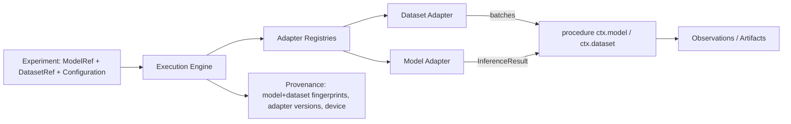

# Model and Dataset Adapters

```
CORE EXPERIONYX (domain, registry, execution, provenance)
        ↓
STABLE ADAPTER PROTOCOLS   (src/experionyx/adapters/base.py)
        ↓
MODEL / DATASET ADAPTERS   (sklearn_adapter.py, torch_adapter.py, third-party packages)
        ↓
FRAMEWORK-SPECIFIC CODE    (scikit-learn, PyTorch)
```

Framework-specific code lives **only** in adapter modules. `experionyx.adapters` (protocols,
capabilities, metadata, registry) and the execution engine never import scikit-learn or
PyTorch; the frameworks are optional extras (`pip install 'experionyx[sklearn]'`,
`'experionyx[torch]'`). **sklearn and PyTorch are the initial concrete integrations, not the
final supported framework set.**



## Protocols
`ModelAdapter`: `NAME`, `VERSION`, `FRAMEWORK`, `load(source, version=, device=, options=)`,
`capabilities`, `metadata()`, `fingerprint()`, `predict`, `batch_predict`, `predict_proba`,
`device` (requested/resolved) and `load_seconds` (cold start, separate from inference time).

`DatasetAdapter`: `load(source, version=, options=)`, `capabilities`, `metadata(deep=False)`,
`fingerprint()`, `splits()`, `num_samples(split)`, `sample(index, split)`,
`batches(batch_size, split)`.

`BaseModelAdapter` / `BaseDatasetAdapter` are optional helpers: they provide `supports()` /
`require()` and make every operation an adapter does not implement raise
`UnsupportedCapabilityError`, so adapters implement only what they support.

## Capabilities
Explicit, typed and extensible (adding an enum member never breaks existing adapters).
Model: `PREDICT`, `BATCH_PREDICT`, `PREDICT_PROBA`. Dataset: `RANDOM_ACCESS`, `ITERATION`,
`BATCHING`, `LABELS`, `TRAIN_SPLIT`, `VALIDATION_SPLIT`, `TEST_SPLIT`. An adapter *class*
declares what it can support (`POSSIBLE_CAPABILITIES`); an *instance* reports what it does
(sklearn offers `PREDICT_PROBA` only if the loaded estimator has `predict_proba`). Check
`ModelCapability.X in adapter.capabilities` before calling, or handle
`UnsupportedCapabilityError`. Embeddings, gradients and feature importance are deliberately not
defined yet.

## Tasks, schemas, metadata
`TaskType`: CLASSIFICATION, REGRESSION, MULTILABEL_CLASSIFICATION, IMAGE_CLASSIFICATION,
TIME_SERIES, ANOMALY_DETECTION, CUSTOM (known but outside the list), UNKNOWN (not safely
inferable). `TensorSchema` describes modality, dtype, shape (`None` dimension = variable),
feature names/kinds and class labels; unknown fields are `None`. `ModelMetadata` and
`DatasetMetadata` carry the standard fields; **`None` always means "unavailable", never zero**
(e.g. sklearn has no general parameter count). Dataset metadata is cheap by default; statistics
that scan the data (`missing_values`, torch `class_count`) run only with `deep=True`.

## Inference results
`InferenceResult` (no metrics): outputs as plain nested tuples, sample IDs, capability used,
batch count/size, `inference_seconds` (monotonic clock, excludes load), per-batch timings,
model fingerprint, adapter name/version, device, warnings. A single timing is not a benchmark.
Batching (`batch_slices`) is contiguous, deterministic, includes the final partial batch, and
never copies more than one batch.

## Registry and discovery
`AdapterRegistry.register / register_lazy / resolve / names / status`; built-ins are registered
lazily so `experionyx adapters list` works without the frameworks and reports
`UNAVAILABLE` with an install hint. Third-party packages register via the entry-point groups
`experionyx.model_adapters` / `experionyx.dataset_adapters` (`name = "package.module:Class"`),
requiring no core change. `default_registries()` returns fresh objects (no global state).

## Versioning
Each adapter has a `VERSION`. It is recorded in registered records and in provenance, is part
of a model/dataset record's identity, and the executor only uses a record whose adapter version
matches the installed adapter; otherwise it asks you to re-register. Same model + different
adapter implementation is therefore distinguishable.

## Devices
`DeviceKind`: CPU (default), MPS, CUDA. MPS/CUDA are used only when explicitly requested **and**
available; otherwise `DeviceUnavailableError` (no silent fallback). Requested and resolved device
are recorded. sklearn is CPU-only. Results may differ across hardware backends; no bitwise
cross-device determinism is claimed.

## Errors
`AdapterError` and subclasses (`AdapterNotFoundError`, `DuplicateAdapterError`,
`AdapterUnavailableError`, `UnsupportedCapabilityError`, `DeviceUnavailableError`,
`ModelLoadError`, `DatasetLoadError`, `InvalidModelError`, `InvalidDatasetError`,
`ModelFingerprintError`, `DatasetFingerprintError`, `InferenceError`). Framework exceptions are
chained as `__cause__`, never leaked directly.

## Contract tests
`tests/contracts.py` defines `ModelAdapterContract` and `DatasetAdapterContract`: a concrete
test class supplies a handful of fixtures and inherits identity, metadata round-trip,
capability, inference, batching, invalid-input, fingerprint-stability, loading-error and device
checks. They run against the pure-Python reference adapters, sklearn and torch. Third-party
adapters can import and reuse them.

## Security
Loading a model is executing data. **sklearn/joblib artifacts are pickle-based: loading an
untrusted file can execute arbitrary code.** Torch models load as TorchScript archives and
tensor datasets with `weights_only=True`, and `.npz` datasets with `allow_pickle=False`, which
avoid arbitrary unpickling, but TorchScript archives are still executable model definitions.
EXPERIONYX runs *trusted local artifacts*; there is no upload or remote-execution path and none
should be added without a sandbox.

See [model-dataset-identity.md](model-dataset-identity.md) for fingerprints and registration.

## Supported adapters and known limitations
Concrete adapters today: **sklearn** (model: joblib-persisted fitted estimators; dataset: numpy
tabular data from `builtin:iris|wine|diabetes` or `.npz`) and **torch** (model: TorchScript
archives or in-memory `nn.Module`; dataset: map-style `Dataset`s or tensor files). Not
final: further frameworks arrive as further adapters.

- **TorchScript is deprecated upstream** (`torch.jit`, in favour of `torch.export`). It still
  works and the adapter silences the `FutureWarning`; migrating the model format to
  `torch.export` archives is planned work, and the fingerprint (weights + module tree) is
  independent of the file format so registered models keep their identity across that change.
- The sklearn model fingerprint identifies a *file*, not a fitted state; re-saving can change it.
- Torch dataset fingerprinting reads every sample once; sklearn dataset fingerprints are computed
  from in-memory arrays and cached per instance.
- `predict_proba` is offered only by sklearn estimators that have it; torch models return raw
  outputs (e.g. logits) from `predict`; no softmax is assumed.
- No embeddings, gradients or feature importance yet; no image/text/series dataset adapters.
- CPU is the tested path. MPS/CUDA are supported by the torch adapter only when requested and
  available; they are not exercised by CI, and numerical results may differ across backends.
- Outputs are materialized as Python tuples: fine for tiny models, not for large batches; a
  streaming/array result type is future work.
- Registered `source` strings are stored verbatim and are not checked for privacy.
