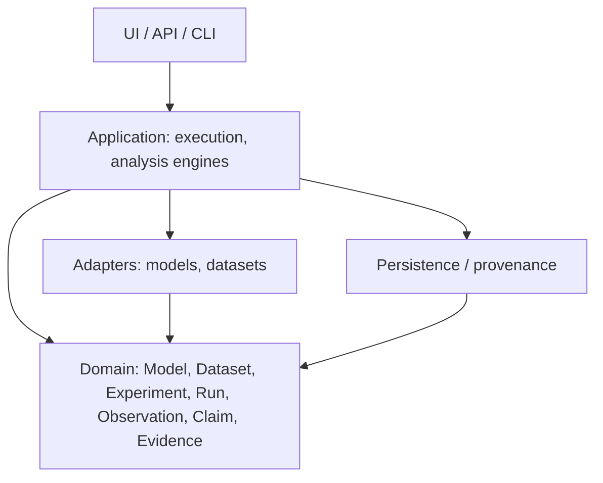

# Architecture

> **Current state:** Phase 10. Implemented: the domain model ([domain-model.md](domain-model.md)),
> hashing/identity ([identity.md](identity.md)), a `Registry` protocol with a SQLite backend
> ([registry.md](registry.md)), an execution engine ([execution.md](execution.md)), provenance
> capture ([provenance.md](provenance.md)), a local artifact store ([artifacts.md](artifacts.md)), a framework-agnostic model/dataset adapter layer with
> sklearn and PyTorch implementations ([adapters.md](adapters.md),
> [model-dataset-identity.md](model-dataset-identity.md)) a baseline evaluation and autopsy engine ([evaluation.md](evaluation.md),
> [observation-vs-conclusion.md](observation-vs-conclusion.md)), a fault injection laboratory
> ([faults.md](faults.md)), failure discovery and a failure registry ([failures.md](failures.md)) fault interaction analysis ([interactions.md](interactions.md)), reliability profiles ([reliability.md](reliability.md)), robustness benchmarks ([benchmarks.md](benchmarks.md)), and statistical analysis ([statistics.md](statistics.md)) and a CLI ([cli.md](cli.md)).
> Everything else below is **planned** and will be introduced
> incrementally.

## Purpose and goals

A laptop-feasible, research-grade laboratory for AI/ML forensics and reliability:
real experiments, traceability, reproducibility, testability, modularity, honest limitations.

## Planned subsystems

Domain model; registries (model, dataset, experiment, environment, configuration, artifact, metric,
failure, drift, evidence); execution engine; adapters (model, dataset); autopsy; fault injection;
failure discovery; reproducibility/statistics; provenance/trace; drift analysis; reliability
analysis; evidence graph; dossier generation; CLI; API; research UI.

## Dependency direction

Dependencies point inward toward the domain; the domain depends on nothing.



Today: `errors`, `validation`, `hashing` → `domain` → `provenance` (entities) → `registry`
(protocol) → `sqlite`; infrastructure (`capture`, `artifacts`) is independent of the registry;
`execution` composes registry + capture + artifacts; `cli` sits on top.

```mermaid
flowchart LR
    ER[Experiment Registry] --> EE[Execution Engine]
    EE --> AD[Adapter Registry] --> MD[Model / Dataset Adapters]
    MD --> PROC[Inference]
    PROC --> EVAL[Evaluation: metrics, calibration, slices, findings]
    EVAL --> RR
    EVAL --> FAULT[Fault laboratory: faulted evaluation vs control]
    FAULT --> RR
    EVAL --> DISC[Failure discovery: signals, clusters, modes]
    FAULT --> DISC
    DISC --> RR
    PROC --> RR
    EE --> PC[Provenance Capture]
    EE --> AS[Artifact Store]
    PC --> RR[Run Registry]
    AS --> RR
    EE --> RR
``` No circular imports; no hidden global state.

## Domain concepts

Model, Dataset, Experiment, Run, Artifact, Observation, Failure (signal, cluster, mode), Claim, Evidence, Investigation.
Definitions and distinctions: [experiment-lifecycle.md](experiment-lifecycle.md).

## Philosophy

- **Provenance:** every observation links to its run, environment, inputs and seed.
- **Storage:** local-first (files + embedded database); large data and weights never committed.
- **Adapters:** third-party ML libraries live behind adapters and are optional extras, keeping
  the core dependency-free.
- **Testing:** real behavior, deterministic seeds, no tests that only inflate counts.
- **API/UI:** thin layers over the same application services; introduced late.
- **Resources:** CPU-first, cached, resumable, bounded parallelism; no clusters or paid services.
- **Configuration:** explicit, validated config objects; not built yet.
- **Logging:** stdlib `logging` under the `experionyx` namespace; the library installs only a
  `NullHandler`, applications (CLI) configure output.
