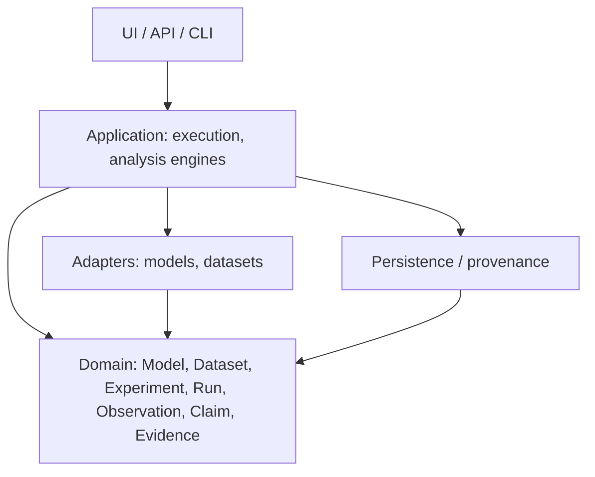

# Architecture

> **Current state:** Phase 0. Only the package skeleton, `domain` enums and a minimal CLI exist.
> All subsystems below are **planned** and will be introduced incrementally.

## Purpose and goals

A laptop-feasible, research-grade laboratory for AI/ML forensics and reliability:
real experiments, traceability, reproducibility, testability, modularity, honest limitations.

## Planned subsystems

Domain model; registries (model, dataset, experiment, environment, configuration, artifact, metric,
failure, drift, evidence); execution engine; adapters (model, dataset); autopsy; fault injection;
failure discovery; reproducibility/statistics; provenance/trace; drift analysis; reliability
analysis; evidence graph; dossier generation; CLI; API; research UI.

## Dependency direction

Dependencies point inward toward the domain; the domain depends on nothing.

Only `domain` and `cli` exist today. No circular imports; no hidden global state.

## Domain concepts

Model, Dataset, Experiment, Run, Artifact, Observation, Failure, Claim, Evidence, Investigation.
Definitions and distinctions: [experiment-lifecycle.md](experiment-lifecycle.md).

## Philosophy

- **Provenance:** every observation links to its run, environment, inputs and seed.
- **Storage:** local-first (files + embedded database); large data and weights never committed.
- **Adapters:** third-party ML libraries live behind adapters and are optional extras, keeping
  the core dependency-free.
- **Testing:** real behavior, deterministic seeds, no tests that only inflate counts.
- **API/UI:** thin layers over the same application services; introduced late.
- **Resources:** CPU-first, cached, resumable, bounded parallelism; no clusters or paid services.
- **Configuration:** explicit, validated config objects; not built yet.
- **Logging:** stdlib `logging` under the `experionyx` namespace; the library installs only a
  `NullHandler`, applications (CLI) configure output.
