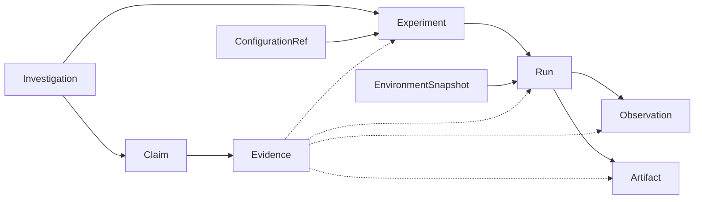

# Domain Model

Implemented in `src/experionyx/domain.py` (Phase 1). All entities are frozen dataclasses that
validate on construction and reject invalid state with `ValidationError`; nothing is coerced
(an enum field must be an enum, a timestamp must be timezone-aware UTC, IDs must have the right
prefix). Mapping/list fields are deep-copied into read-only structures.

| Entity | Purpose | Identity fields (see [identity.md](identity.md)) |
|---|---|---|
| `Investigation` | Research question grouping experiments | name, question |
| `ConfigurationRef` | Content-addressed parameter set | parameters |
| `EnvironmentSnapshot` | Python/OS/machine/packages/source revision of a run | all fields |
| `Experiment` | Reproducible definition: model, dataset, configuration, hypothesis | investigation, name, hypothesis, model, dataset, configuration |
| `Run` | One execution of an experiment (environment + seed + attempt) | experiment, environment, seed, attempt |
| `Observation` | Measured value (scalar or JSON-structured, frozen) from a run | run, name, sequence |
| `Artifact` | Metadata of a file a run produced (name, category, path, sha256, size, media type) | run, path, digest |
| `Provenance` | Inputs/context of a run: environment, dependencies, source, config, seed, execution (see [provenance.md](provenance.md)) | run |
| `RunOutcome` | How a run ended: status, duration, structured error, artifact IDs, observation count | run |
| `RegisteredModel` / `RegisteredDataset` | Model/dataset identity: name, version, adapter (+version), fingerprint, source, load options, standardized metadata (see [model-dataset-identity.md](model-dataset-identity.md)) | name, version, adapter, adapter version, fingerprint, options |
| `Claim` | Statement in an investigation, with `asserted_by` and a `ClaimStatus` | investigation, statement |
| `Evidence` | Links a claim to an experiment/run/observation/artifact as SUPPORTS/REFUTES/CONTEXT | claim, target kind, target, relation |

`ModelRef` and `DatasetRef` (name, version, optional digest) are value objects embedded in
`Experiment`, not separate records.

## Relationships

Arrows mean "is referenced by": a child stores its parent's ID. Dotted arrows are the polymorphic
evidence target (`target_kind` + `target_id`).

## Lifecycles

- `Experiment`: DRAFT → READY → RUNNING → COMPLETED | FAILED; DRAFT/READY/RUNNING → CANCELLED.
- `Run`: PENDING → RUNNING → COMPLETED | FAILED; PENDING → FAILED.
- `with_status()` enforces these transitions. `ClaimStatus` values are domain states only; no
  code evaluates a claim against evidence yet.

## Failure records (Phase 6)

`FailureSignal` (`fsg_`), `FailureCluster` (`fcl_`), `FailureMode` (`fmd_`), `FailureEvidence`
(`fev_`) and `FailureRelationship` (`frl_`) follow the same rules as the other entities:
immutable, content-addressed, strictly validated. A signal and a cluster are observations and
groupings; only a mode has a lifecycle, `DISCOVERED -> CANDIDATE -> SUPPORTED -> CONFIRMED`
(plus `REJECTED`/`DEPRECATED`), with validated transitions and retained evidence. See
[failures.md](failures.md).

## Interaction records (Phase 7)

`InteractionAnalysis` (`ian_`, with a lifecycle `DISCOVERED -> SUPPORTED -> REPRODUCIBLE ->
CONFIRMED_BY_REVIEW`, plus `REJECTED`/`DEPRECATED`), `InteractionEffect` (`ief_`) and
`InteractionEvidence` (`iev_`) are immutable and content-addressed; only the analysis status is
mutable. See [interactions.md](interactions.md).

## Reliability records (Phase 8)

`ReliabilityProfile` (`rpf_`) and `ReliabilityReference` (`rrf_`) are immutable and content-addressed.
A profile stores metadata and per-dimension statuses only; observations live in a digest-verified
artifact. See [reliability.md](reliability.md).

## Stress records (Phase 14)

`StressAnalysis` (`sxa_`) is one stress experiment over a validated baseline; `StressTrial` (`sxt_`) is one
expanded unit (point x repeat x cell), a real run. Trial evidence names its origin (Fault Laboratory or
model-level). See [stress.md](stress.md).

## Data quality records (Phase 13)

`QualityAnalysis` (`qan_`) is one analysis of a registered dataset; `QualityCheck` (`qck_`) is one check
result on one scope. Measurements, violations and evidence live in digest-verified artifacts. See
[data-quality.md](data-quality.md).

## Drift records (Phase 12)

`DriftWindow` (`twn_`) is a registered temporal window definition (identity: ordering field, role,
bounds, inclusivity); `DriftAnalysis` (`dan_`) is one analysis over a baseline run (windows, per-feature,
distribution and performance results live in digest-verified artifacts). See [drift.md](drift.md).

## Slice records (Phase 11)

`Slice` (`sls_`) is a logical slice definition whose identity is its normalized condition; `SliceAnalysis`
(`san_`) is one analysis run over a baseline (membership, metrics, comparisons and per-slice fault,
failure-mode and interaction evidence live in digest-verified artifacts). See [slices.md](slices.md).

## Statistical analysis records (Phase 10)

`StatisticalAnalysis` (`sta_`) is an immutable, content-addressed record of one computation: settings,
sources (references into digest-verified artifacts, or inline inputs), result and digests. It can be cited
as claim evidence. See [statistics.md](statistics.md).

## Benchmark records (Phase 9)

`Benchmark` (`bmk_`, the versioned definition), `BenchmarkResult` (`brs_`, one execution's coverage and
section statuses) and `BenchmarkUnit` (`bun_`, each expanded experiment unit with its status and run) are
immutable and content-addressed. See [benchmarks.md](benchmarks.md).

## Observation kinds
`Observation.epistemic_kind` is `OBSERVATION` or `DERIVED_METRIC` (never interpretation or
hypothesis), following [methodology.md](methodology.md).

## Intentional limitations
- Evidence is checked to point at an existing record, not to belong to the same investigation
  as its claim.
- `Claim.status` is not validated against its evidence.
- Artifact bytes live in the artifact store, not the registry; see [artifacts.md](artifacts.md).
- Entities are not hashable (they may contain read-only mappings).
