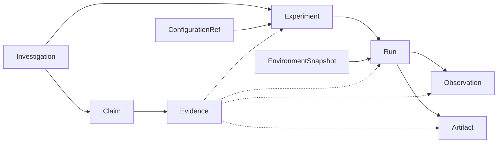

# Domain Model

Implemented in `src/experionyx/domain.py` (Phase 1). All entities are frozen dataclasses that
validate on construction and reject invalid state with `ValidationError`; nothing is coerced
(an enum field must be an enum, a timestamp must be timezone-aware UTC, IDs must have the right
prefix). Mapping/list fields are deep-copied into read-only structures.

| Entity | Purpose | Identity fields (see [identity.md](identity.md)) |
|---|---|---|
| `Investigation` | Research question grouping experiments | name, question |
| `ConfigurationRef` | Content-addressed parameter set | parameters |
| `EnvironmentSnapshot` | Python/OS/machine/packages/source revision of a run | all fields |
| `Experiment` | Reproducible definition: model, dataset, configuration, hypothesis | investigation, name, hypothesis, model, dataset, configuration |
| `Run` | One execution of an experiment (environment + seed + attempt) | experiment, environment, seed, attempt |
| `Observation` | Measured value (scalar or JSON-structured, frozen) from a run | run, name, sequence |
| `Artifact` | Metadata of a file a run produced (name, category, path, sha256, size, media type) | run, path, digest |
| `Provenance` | Inputs/context of a run: environment, dependencies, source, config, seed, execution (see [provenance.md](provenance.md)) | run |
| `RunOutcome` | How a run ended: status, duration, structured error, artifact IDs, observation count | run |
| `Claim` | Statement in an investigation, with `asserted_by` and a `ClaimStatus` | investigation, statement |
| `Evidence` | Links a claim to an experiment/run/observation/artifact as SUPPORTS/REFUTES/CONTEXT | claim, target kind, target, relation |

`ModelRef` and `DatasetRef` (name, version, optional digest) are value objects embedded in
`Experiment`, not separate records.

## Relationships

Arrows mean "is referenced by": a child stores its parent's ID. Dotted arrows are the polymorphic
evidence target (`target_kind` + `target_id`).

## Lifecycles

- `Experiment`: DRAFT → READY → RUNNING → COMPLETED | FAILED; DRAFT/READY/RUNNING → CANCELLED.
- `Run`: PENDING → RUNNING → COMPLETED | FAILED; PENDING → FAILED.
- `with_status()` enforces these transitions. `ClaimStatus` values are domain states only; no
  code evaluates a claim against evidence yet.

## Observation kinds
`Observation.epistemic_kind` is `OBSERVATION` or `DERIVED_METRIC` (never interpretation or
hypothesis), following [methodology.md](methodology.md).

## Intentional limitations
- Evidence is checked to point at an existing record, not to belong to the same investigation
  as its claim.
- `Claim.status` is not validated against its evidence.
- Artifact bytes live in the artifact store, not the registry; see [artifacts.md](artifacts.md).
- Entities are not hashable (they may contain read-only mappings).
