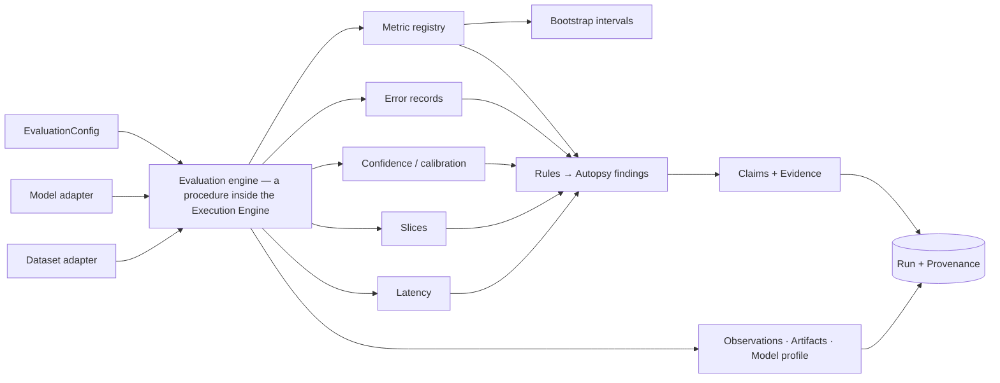

# Baseline Evaluation and Model Autopsy

Implemented in `src/experionyx/evaluation/` (Phase 4). This layer **measures** what a model does
under controlled baseline conditions and records forensic **observations**. It does not diagnose
causes. See [observation-vs-conclusion.md](observation-vs-conclusion.md).

The evaluation is a normal EXPERIONYX run: `experionyx.evaluation.engine:run_evaluation` is the
procedure, the `EvaluationConfig` is the experiment's `ConfigurationRef` (content-addressed,
therefore part of provenance and replayable), and the model/dataset are bound and
fingerprint-verified by the execution engine. Everything is pure Python over standardized
adapter outputs; no framework code lives here.

## Configuration
`EvaluationConfig` is typed, validated and serialized as `{"evaluation": {...}}`. Reading it
back **rejects unknown fields, wrong types and unknown enum values**. It controls: `split`,
`batch_size`, `metrics`, `task` (override), `positive_label`, `score_source`, `calibration`
(bins, confidence thresholds), `bootstrap` (resamples, confidence, seed, metrics, slices),
`errors` (recording, retention), `retention` (sample-level predictions, `max_samples`), `slices`
and `thresholds`. Device is an executor setting and is recorded in provenance.

## Result model
Separate concepts, never conflated: `MetricResult` (a measurement with context, not an
Observation), `SamplePrediction`, `ErrorRecord` (not a failure mode), `SliceResult`,
`CalibrationResult`, `ConfidenceResult`, `LatencySummary`, `AutopsyFinding`, `ModelProfile`, and
the aggregate `EvaluationResult`. Every analysis carries a `Status`: `COMPUTED`, `UNDEFINED`
(mathematically undefined for these data), `UNSUPPORTED` (the model/config does not provide the
inputs), `INVALID` (non-finite or inconsistent numerics) plus a reason. **An unavailable analysis
is never zero.** Results round-trip through strict JSON (`from_jsonable`).

## Metrics
`default_metric_registry()` (fresh per call; new metrics register without touching the engine).
Each `MetricSpec` declares id, name, implementation version, tasks, requirements
(`LABELS`, `SCORES`), scale and direction.

| Task | Metrics |
|---|---|
| Classification | `accuracy`, `balanced_accuracy`, `precision`, `recall`, `f1` (macro), `confusion_matrix`, `roc_auc`, `pr_auc` (average precision), `log_loss` |
| Regression | `mae`, `mse`, `rmse`, `r2`, `median_absolute_error` |

Semantics: precision/recall/F1 are macro-averaged over labels present in `y_true` or `y_pred`;
a class with undefined precision/recall counts as 0 in the average **with a recorded warning**
(scikit-learn's `zero_division` convention); per-class values stay `None` when undefined.
`roc_auc`/`pr_auc` are one-vs-rest macro (binary: second class positive) and need per-class
scores; they are `UNDEFINED` if any class lacks positives or negatives. `log_loss` clips
probabilities to `[1e-15, 1]`. `r2` is undefined for constant targets. A metric requiring scores
is `UNSUPPORTED` when none exist: it is never derived from hard labels. Each `MetricResult`
records metric id/version, split, sample count, classes, value, scale, status, warnings, and the
run/model/dataset context. Nothing is rounded internally.

## Baseline methodology
1. The engine reads the configuration; the executor has bound and verified model and dataset.
2. Task = configured task, else the model's/dataset's (a disagreement is an error).
3. The split is read **in dataset order**, batch by batch. Only labels, predictions, optional
   scores and the columns needed by slices are retained in memory; sample-level predictions are
   **streamed** to `predictions.jsonl`. `retention.max_samples` bounds memory (larger requests
   fail explicitly).
4. Non-finite targets/predictions/scores are **excluded and recorded** (`excluded`: count,
   reason, first indices) with a warning; if nothing valid remains the run fails.
5. Metrics, intervals, confusion/per-class, imbalance, confidence, calibration, errors, slices,
   latency, findings, profile are computed; artifacts, observations, claims and evidence persisted.

**Scores.** `score_source=AUTO` uses `predict_proba` if the model supports it, else no scores.
`PREDICT_PROBA` requires it (an unsupporting model yields explicit `UNSUPPORTED` results, not an
exception). `SOFTMAX_LOGITS` applies softmax to model outputs and **assumes they are logits**;
that assumption is written into the confidence source of every derived analysis. `NONE` forces
labels only. Class-column alignment comes from the model's declared class labels; with logits and
no declared labels, columns `0..k-1` are assumed to be labels `0..k-1`.

## Class imbalance
Counts, proportions, majority/minority classes and their ratio, plus the standing caveat that
accuracy can be misleading under imbalance. No rebalancing (analysis, not intervention).

## Errors
Classification records (one per sample with at least one kind): `FALSE_POSITIVE`/`FALSE_NEGATIVE`
(binary; positive label = `positive_label` or the second class), `INCORRECT_CLASS` (multiclass),
`HIGH_CONFIDENCE_INCORRECT` (wrong at confidence >= `high_confidence`),
`LOW_CONFIDENCE_CORRECT` (right at confidence < `low_confidence`). Regression records residuals
(`signed_error` = prediction - target, `absolute_error`, `relative_error` only when target != 0)
and retains the `max_records` largest absolute errors (ties by sample order). **Counts are always
complete; only the retained records are bounded.** Error records are inputs for later failure
clustering, not failure modes.

## Confidence and calibration
Interpretation: *top-label (confidence) calibration*. Confidence = the largest class
probability; "correct" = the model's predicted label equals the truth. Bins are **equal-width**
over [0, 1]: bin k = [k/B, (k+1)/B), the last closed at 1; `B` is configured (default 10) and
recorded, so binning never changes silently. Per bin: count, mean confidence, accuracy, gap.
**ECE** = sum over bins of (n_bin/N)·|accuracy − mean confidence|; **MCE** = the largest gap over
non-empty bins; **Brier** = mean over samples of the sum over classes of (p_k − 1[y=k])² (twice
scikit-learn's binary `brier_score_loss`). Bin data is persisted (`calibration.json`), so a
reliability diagram can be regenerated; no image is generated. Confidence analysis adds the
10-bin confidence histogram, mean confidence on correct vs incorrect predictions, and
high-confidence-error / low-confidence-correct counts. Confidence is **not assumed calibrated**;
its source is recorded. Models with no probabilities get `UNSUPPORTED` with the reason. Fewer than
100 samples yields a noise warning. Class-conditional (per-class) calibration is not implemented.

## Bootstrap intervals
Percentile bootstrap (`random.Random(seed)`): `resamples` index sets of size n with replacement,
metric recomputed, quantiles at (1−c)/2 and 1−(1−c)/2 (linear interpolation, matching NumPy's
default). Deterministic for a given seed. Recorded: method, confidence, resamples, valid
resamples, seed, n, bounds, warnings. Defaults: accuracy+F1 (classification), MAE+RMSE
(regression); configurable; optionally for slices. Limitations: percentile intervals can
under-cover for small n or skewed statistics, ignore dependence between samples, say nothing
about distribution shift, and are not universally better than analytical intervals. Warnings are
issued for n < 30, fewer than 1000 resamples, and resamples where the metric was undefined
(dropped and counted).

## Slices
A `SliceSpec` is a named AND of `SliceCondition`s: `TARGET_EQUALS`, `PREDICTED_EQUALS`,
`FEATURE_EQUALS`, `FEATURE_RANGE` (`low <= x < high`, either bound optional). Features are
addressed by name (from dataset metadata) or column index and must be numeric. There is no query
language, and no metadata-field slices (dataset adapters expose no per-sample metadata yet). Each
slice is evaluated with the same scalar metrics; `deltas_vs_overall` is slice − overall.

## Latency
From the adapters' per-batch inference timings (monotonic clock): total, mean, median,
nearest-rank p95, max, throughput (never divides by zero), sample and batch counts. **Load time
is reported separately** and never mixed in. Small batch counts carry warnings; this is a
measurement of one run on one machine, not a benchmark.

## Autopsy findings and thresholds
Rules (`findings.RULES`, ruleset version `RULESET_VERSION`) are explicit, deterministic and
driven by `Thresholds` in the configuration:

| Rule | Fires when |
|---|---|
| `class-imbalance` | majority/minority ratio >= `imbalance_ratio_min` (3.0) |
| `minority-recall` | recall of the least frequent class < `minority_recall_max` (0.5) |
| `ece-threshold` | ECE > `ece_max` (0.10) |
| `high-confidence-errors` | high-confidence errors / samples > `high_confidence_error_rate_max` (0.05) |
| `r2-floor` | regression R² < `r2_min` (0.5) |
| `latency-outlier` | max batch / median batch > `latency_outlier_factor` (5) with >= 5 batches |
| `slice-accuracy-drop` | slice accuracy/F1 more than `slice_accuracy_drop_max` (0.10) below overall |
| `slice-error-increase` | slice MAE/RMSE more than `slice_error_increase_max` (25%) above overall |

A finding records type, severity (NOTICE/WARNING: a diagnostic category), rule id+version,
affected population, observed value, threshold, comparison, supporting metrics, observation
names, artifact paths, and `interpretation = OBSERVED`. Descriptions are deterministic templates
that state *what was measured*, never *why*. Thresholds are diagnostics, not universal truths;
`INTERPRETED` exists as a state but is never assigned automatically.

## Evidence linking
Each finding becomes a `Claim` (a narrow statement about the measurement, prefixed with the run
ID, status SUPPORTED by the measurement) with `Evidence` rows (SUPPORTS) to the supporting
`Observation`s and `Artifact`s and a CONTEXT link to the `Run`. The chain is
Run → observation/artifact → evidence → claim, and `findings.json` stores the claim and evidence
IDs. Only *computed* values become Observations; unavailable analyses live in the artifacts with
their status and reason. Observation names: `metric.<id>`, `metric.<id>.interval`,
`calibration.{ece,mce,brier_score}`, `confidence.*`, `imbalance.ratio`, `errors.<kind>`,
`per_class.<label>.*`, `latency.*`, `slice.<name>.*`, `n_samples`, `excluded_samples`.

## Artifacts (`evaluation/` in the run's artifact directory)
`metrics.json`, `confusion.json` (matrix, per-class, imbalance), `calibration.json` (bins,
confidence), `bootstrap.json`, `slices.json`, `latency.json`, `findings.json`, `profile.json`,
`evaluation.json` (complete result), `errors.jsonl`, `predictions.jsonl`. All are machine-readable
JSON/JSONL, deterministic bytes (sorted keys), registered with SHA-256 digests. Metric contexts
embed the run ID, and latency varies per execution; everything else is identical across replays of
a deterministic model.

## Model profile
`ModelProfile` (structured data only): model/dataset identity and fingerprints, task, capabilities,
parameter count and size where available (`None` otherwise), baseline metric values, calibration
status and ECE, error counts, per-class behavior, latency, slice sizes, findings by type, and
`unavailable_analyses` with reasons.

## Comparison
`compare_evaluations(a, b)` returns deltas (b − a) for metrics (with an `intervals_overlap` fact),
class-wise precision/recall/F1, slices, calibration and latency, plus warnings (different
dataset/split/sample count/classes). It ranks nothing, declares no winner, and does no
significance testing (later phases).

## Numerical limitations
Pure-Python double precision; results match scikit-learn to ~1e-12 in tests. Float summation
order may differ from NumPy, and different batch sizes can change model outputs in the last
bits on some platforms. Pure Python is intended for small/medium data (bounded by
`max_samples`; bootstrap cost is resamples × n × metrics). NaN/inf are never converted to zero:
they are excluded (recorded) or make the analysis `INVALID`. No cross-hardware statistical
reproducibility is claimed.

## CLI
`experionyx metrics list`, `experionyx evaluate --model mdl_… --dataset dst_…`,
`experionyx model autopsy mdl_… --dataset dst_…`, `experionyx evaluation inspect <run>`,
`experionyx evaluation compare <run-a> <run-b>`. See [cli.md](cli.md).
