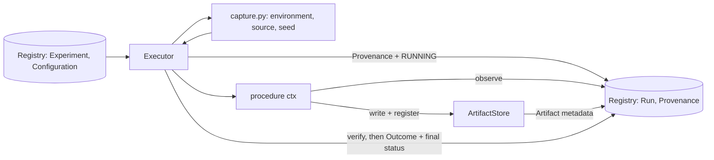

# Execution Engine

Implemented in `src/experionyx/execution.py` (Phase 2). It runs a *procedure* (a plain Python
callable) against a registered `Experiment` and leaves a durable record. It knows nothing about ML
frameworks: model adapters (later phases) will be procedures or will be called by them.

```
Experiment Registry → Execution Engine → Provenance Capture → Artifact Store → Run Registry
```



## Procedures and RunContext
A procedure is `Callable[[RunContext], None]`, recorded by import path (`module:function`).
`RunContext` is immutable and typed: `experiment`, `run`, `configuration` (+ `.parameters`),
`seed`, `started_at`, `source`, `execution` (procedure name, advisory `ResourceLimits`, typed
`metadata` extension point), `artifact_dir`, `project_root`. Procedures report results through
`ctx.observe(name, value, unit=…)` and `ctx.register_artifact(path)`; both persist immediately.

## Run lifecycle
`Executor.execute(experiment_id, procedure, seed=…)`:

1. Validate. The experiment must exist and not be DRAFT/CANCELLED/FAILED (the executor never
   changes an experiment's own status; that is an aggregate concern for later phases).
2. Capture environment and source revision, seed the RNGs.
3. Create a `Run` (PENDING). The environment snapshot is registered if new.
4. Write `Provenance` and move to RUNNING in **one transaction** (`metadata/provenance.json`
   is written first, atomically).
5. Call the procedure. Observations and artifacts are recorded as they happen.
6. Verify every registered artifact against its bytes again.
7. Write `RunOutcome` and the final status (COMPLETED/FAILED) in **one transaction**.

Errors raised by the procedure do not propagate: the run becomes FAILED with a structured
`ErrorInfo` (stage, qualified exception type, message) and a sanitized traceback stored as a
DIAGNOSTIC artifact. `KeyboardInterrupt`/`SystemExit` are recorded (INTERRUPTED) and then re-raised.
Failures **before a Run exists** (unknown experiment, bad seed, environment capture failure) raise
`PreparationError`/`NotFoundError`; there is no Run to attach them to. A failure after the run
exists but before it starts is recorded as FAILED/PREPARATION.

## Consistency guarantees
- A run cannot be COMPLETED without its outcome, and the outcome and status commit together.
  The registry additionally enforces: legal status transition, outcome artifacts exist and belong
  to the run, observation count matches, a RUNNING run has provenance.
- An artifact row exists only after its file was successfully hashed.
- The filesystem and database cannot be updated atomically together. Files are written first;
  the database is authoritative. A crash can leave orphan files (harmless) or a RUNNING run with
  no outcome. `Executor.recover_interrupted()` (CLI: `recover`) closes such runs as
  FAILED/INTERRUPTED when the pid recorded in provenance is gone (POSIX, same host only; a reused
  pid hides a dead run). A crash between run creation and start leaves a PENDING run, visible via
  `run_states()`.
- If finalization itself fails (e.g. database error) the exception propagates and the run stays
  RUNNING with nothing half-written; `recover_interrupted` can close it later.
- `metadata/outcome.json` is a convenience mirror written after commit; if it cannot be written a
  warning is logged and the registry remains correct.

## Retry, resumption, RUN vs REPLAY vs REPRODUCTION
Runs are never overwritten. Executing again with the same experiment, seed and environment
creates a new Run with the next `attempt` number (distinct identity), so a failed run is retained
and a retry is explicit. `run_states()` lists runs by PENDING/RUNNING/COMPLETED/FAILED.

| Term | Meaning | Exists today |
|---|---|---|
| **RUN** | One recorded execution | yes |
| **REPLAY** | A *new* Run created from a finished run's recorded inputs (experiment, seed, procedure, resources, metadata). `Provenance.replay_of` points at the original. State: REPLAY_REQUESTED | yes |
| **REPRODUCTION** | Evidence that a replay reproduced the original's results within stated tolerance (REPRODUCTION_VERIFIED) | **no** (later reproducibility phase) |

`Executor.replay(run_id)` works for COMPLETED and FAILED runs, re-resolves the recorded procedure
by import path (or takes an override, which then shows up in the fingerprint), and never touches
the original. Replay records the *current* environment and source; compare with
`compare_provenance(a, b)`.

## Concurrency
One registry object = one SQLite connection, single thread. Writes run inside `BEGIN IMMEDIATE`
transactions, so simultaneous writers (threads with their own registry, or processes) serialize on
the database lock; a writer waits up to `timeout` seconds and then raises
`sqlite3.OperationalError`. Status updates are compare-and-swap on the previous status. This
protects against accidental simultaneous mutation on one machine. There is no distributed
execution, no work queue, and no protection against two processes *executing* the same
experiment concurrently (they get separate runs).

## Seeds
The requested seed is always recorded. `seed_everything` seeds Python's `random` and NumPy's
global RNG if NumPy is installed, and the libraries seeded are recorded in provenance
(`runtime.seeded_libraries`). This is **seed recorded**, not **execution guaranteed
deterministic**: threads, hash randomization (`PYTHONHASHSEED`), hardware, and ML frameworks are
outside its reach, and future model adapters own framework-specific determinism.

## Adapter-backed runs
With `Executor(adapters=default_registries(), inputs_root=workspace)`, a `ModelRef`/`DatasetRef`
with a digest that matches a registered model/dataset is resolved to its adapter, loaded and
fingerprint-verified **before** the run starts; the procedure receives `ctx.model`, `ctx.dataset`
and `ctx.device`. Load failures, fingerprint mismatches and stale adapter versions fail the run in
the PREPARATION stage. See [adapters.md](adapters.md) and
[model-dataset-identity.md](model-dataset-identity.md). The executor depends only on the adapter
*protocols*, never on a framework.

## Not done here
Resource limits are recorded, not enforced. No timeouts, no process isolation, no scheduler.
