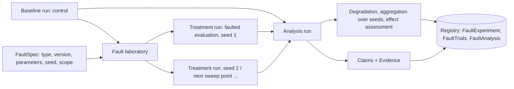

# Fault Injection Laboratory

Implemented in `src/experionyx/faults/` (Phase 5). It answers one question with measurements:
**what happens to a model's measured behaviour when a specified perturbation is applied?** It does
not label models robust or fragile, does not name failure modes, and does not claim causes.

## Vocabulary (never conflated)
| Term | Meaning here |
|---|---|
| **Fault** | A typed, versioned *specification*: what to do, with which parameters, seed and scope. |
| **Perturbation** | The *application* of a fault to concrete data (a derived, faulted view of a dataset). |
| **Observation** | A measured value (e.g. accuracy on the faulted view). |
| **Degradation** | A *measured, direction-aware change* of a metric between control and treatment. |
| **Failure** / **failure mode** | Later-phase concepts (registry, clustering, evidence). Phase 5 never asserts them; a threshold crossing is not "the model failed". |

## Fault model
`FaultSpec` = `type`, `version`, typed `parameters` (a frozen dataclass per fault, never a dict),
`seed`, `scope`, and for compound faults an **ordered** tuple of component specs.
- `family_id` (`flt_…`) identifies the fault without its seed; `id` (`fap_…`) includes every seed.
  Both are hashes of the canonical specification (type, version, parameters, scope, components);
  no timestamps. Numbers are normalized (`1` and `1.0` are the same fault). A different version,
  parameter, scope, component order or seed yields a different identity.
- Specs are stored as canonical JSON and re-read strictly; the exact recorded implementation
  version must still be registered, otherwise reproduction fails loudly.

## Taxonomy
`INPUT_CORRUPTION`, `LABEL_CORRUPTION`, `MISSINGNESS`, `NOISE`, `TRANSFORMATION` are implemented.
`DISTRIBUTION_SHIFT` (`covariate_shift`), `TEMPORAL_CORRUPTION` (`temporal_delay`) and
`RESOURCE_FAULT` (`resource_throttle`) are **registered but not implemented**: they exist so the
vocabulary is stable, they appear in `experionyx faults` marked *NOT IMPLEMENTED*, and running one is
refused before execution. `COMPOUND` is the ordered composition mechanism.

## Registry and library
`FaultRegistry` (fresh per `default_fault_registry()`, keyed by name and version, numeric version
ordering) with `register`, `resolve`, `make` (validated construction), `compound`, `from_dict`. A
`FaultType` carries category, target (`INPUT`/`LABEL`), parameter type and docs, requirements,
stochasticity and the implementation. New faults are added by registering; the engine never
names a fault.

| Fault | Category | Parameters | Requires |
|---|---|---|---|
| `gaussian_noise` | NOISE | `sigma >= 0` | float array |
| `uniform_noise` | NOISE | `half_width >= 0` | float array |
| `feature_dropout` | MISSINGNESS | `probability in [0,1]`, `value` | float array |
| `missing_values` | MISSINGNESS | `probability`, `fill_value` (null = NaN) | float array |
| `feature_mask` | MISSINGNESS | `fraction`, `value` (fixed random columns) | 2-D float |
| `feature_scaling` | TRANSFORMATION | `factor > 0`, `fraction` of columns | 2-D float |
| `feature_offset` | TRANSFORMATION | `offset`, `fraction` | 2-D float |
| `feature_permutation` | TRANSFORMATION | `fraction` (>= 2 columns cyclically permuted; a column-order fault, not permutation importance) | 2-D float |
| `outlier_injection` | INPUT_CORRUPTION | `probability`, `magnitude > 0` | float array |
| `salt_and_pepper` | NOISE | `probability`, `low`, `high` | image (>= 3-D) float |
| `brightness` | TRANSFORMATION | `delta`, clip range | image float |
| `contrast` | TRANSFORMATION | `factor > 0`, clip range | image float |
| `random_occlusion` | INPUT_CORRUPTION | `fraction in (0,1]` of image side, `value` | image float |
| `box_blur` | TRANSFORMATION | `radius >= 1` (numpy; no extra dependency) | image float |
| `label_flip` | LABEL_CORRUPTION | `rate`, optional `classes` (always a different class) | class labels |
| `label_randomize` | LABEL_CORRUPTION | `rate`, `classes` (uniform draw, may keep the label) | class labels |

Parameters are validated at construction (finite, ranges, incompatible combinations), so an
invalid fault fails **before any experiment exists**. Every fault declares its requirements
(floating dtype, 2-D vs image shape, class labels); image faults are never forced onto arbitrary
tensors. **Label faults corrupt the evaluation targets, not what the model sees**: they measure
the effect of data quality on measured metrics, a different experiment from input robustness.

## Determinism and mutation
All randomness comes from numpy `Generator`s seeded from `(seed, sample position, component)`;
per-run column choices from `(seed, component)`. Results therefore do **not** depend on batch size
or evaluation order (tested). Bitwise identity across numpy versions, CPUs or operating systems is
**not** claimed. Faults never mutate their inputs: each returns a new array with only affected
rows changed (copy per batch, bounded memory); the source dataset is never modified. dtype and
shape are preserved. Non-finite input values propagate; nothing is silently replaced.

## Scope
`ALL`, `RANDOM_SUBSET(fraction)` (exactly `round(fraction × n)` samples of the evaluated split,
chosen deterministically), `CLASS(label)` (samples whose *true* target equals the label). `SLICE`,
`FEATURE`, `REGION`, `TIME_WINDOW` are reserved and rejected. Scope is part of fault identity: a
fault on 100% and on 10% of samples are different faults.

## Baseline / treatment design
A `FaultExperiment` links **one baseline (control) run** to its treatment runs. The control is the
ordinary baseline evaluation with the **same** model, dataset and `EvaluationConfig` as every
treatment; the only difference is the fault. Each treatment is a real run of
`faults.engine:run_fault_evaluation`, which evaluates the model on a `FaultedDataset` view with
the *same* evaluation engine (`evaluation.engine.evaluate`). A baseline run can be reused
(`--baseline-run`) only if its configuration, model and dataset match exactly. Runs use one
constant executor seed; fault seeds live in the specs. The registry rejects a trial whose control
differs from its experiment's.

The **faulted dataset's identity** = hash(source fingerprint, fault id (type, version, parameters,
scope, seeds, component order), split). It is what metric contexts record as the dataset
fingerprint. It is not materialized: it is regenerated from the source dataset plus the stored
specification. Materialization would be needed only to hand the perturbed data to a system
outside EXPERIONYX; the streamed content digest (`resulting_content_digest`, platform dependent)
is recorded for verification.

## Degradation methodology
Per metric: `absolute_delta = faulted − baseline`, `relative_delta = absolute_delta / |baseline|`
(`None` if baseline is 0). Direction is explicit (`HIGHER_IS_BETTER`, `LOWER_IS_BETTER`,
`NEUTRAL`) and taken from the metric registry; `deterioration` is signed so **positive always means
worse** (−Δ for accuracy/F1/AUC/R², +Δ for MAE/RMSE/log-loss). Neutral metrics get no
deterioration. A metric missing or undefined on either side is `UNDETERMINED` with the reason,
never zero. Latency is compared separately (lower is better) and excludes fault-application time.
Timings are kept apart: fault application, evaluation excluding fault, whole run.

## Sweeps and repeated experiments
A `SweepSpec` varies one numeric parameter over explicit values; `seeds` repeat each point.
Every (value, seed) is a real, separately recorded run; series rows carry parameter, baseline,
faulted value, deltas, sample count, seed, run ID and fault ID. Nothing is interpolated. Failed
trials are stored as `FAILED` with the reason (the run stays traceable); trials skipped by
early termination (`max_failed_trials`) are stored as `SKIPPED`. Raw per-trial results are always
kept next to aggregates.

## Statistical aggregation and its limits
Per point over completed seeds: n, mean, median, sample standard deviation, min/max, a
deterministic percentile-bootstrap interval **of the mean**, and `effect_size_dz` (mean/std of the
per-seed deterioration; `None` without spread). **No significance tests are run.** Seeds vary
only the perturbation randomness on the *same* evaluation samples, so they are not independent
draws from a population: the interval describes variability of the perturbation, not sampling
uncertainty of the test set, and supports no significance claim. For a single trial the only
uncertainty check is whether the baseline and faulted metric intervals are separated.

## Effect assessment (diagnostic, not a verdict)
`FaultThresholds` (configuration): minimum and substantial absolute/relative deterioration,
minimum affected fraction, and whether uncertainty must exclude "no change". Rule: missing metric
→ `INCONCLUSIVE`; affected fraction below minimum → `INCONCLUSIVE`; deterioration ≤ 0 or below
either minimum → `NO_MEASURED_DEGRADATION`; uncertainty required but including no change →
`INCONCLUSIVE`; both substantial thresholds met → `SUBSTANTIAL_DEGRADATION`; else
`MEASURED_DEGRADATION`. The classification describes one metric under one fault specification and
design. It never says a model "failed".

## Severity
`FaultSeverity` keeps dimensions apart: parameter intensity, affected fraction, primary
deterioration (mean and interval), per-class recall deterioration, per-slice deterioration. There
is deliberately **no composite score** in this phase.

## Compound faults and the interaction foundation
`registry.compound(A, B)` preserves component specs, **order**, parameters, seeds and scopes;
A→B and B→A have different identities and are applied in the stated order (tested to differ).
Repeating a compound fault derives per-component seeds deterministically. Sweeping a compound's
parameters is not supported. `describe_interaction` records effect(A), effect(B), effect(A+B) and
an additive reference, explicitly **descriptive**: a difference from the additive reference is not
evidence of interaction; that needs a defined interaction model and factorial design, now provided by
[interactions.md](interactions.md).

## Safety limits
`FaultLimits`: `max_points`, `max_repetitions`, `max_total_runs`, `max_total_sample_evaluations`,
`max_bootstrap_resamples`, optional `max_failed_trials` (early termination). Exceeding one refuses
the experiment **before any run exists** (`FaultLimitError`); nothing is silently truncated. The
limits in force are stored in the experiment design. Each run loads and verifies its model through
the execution engine, so the model is loaded once per run (no reuse across points): provenance and
verification are prioritized over speed. Everything is CPU-first.

## Provenance, artifacts and evidence
Lineage: model → dataset → baseline run → fault spec/parameters/seed/scope → faulted dataset
identity → treatment run → evaluation → analysis run → claims/evidence. A treatment run's
`fault/fault.json` holds source dataset ID, fault ID/family/spec, seed, scope, affected and total
samples, per-component reports (label faults: labels actually changed), timings, the content digest
and versions. The analysis run stores `design`, `trials` (raw), `sweep` (series), `aggregate`,
`assessment`, `comparison`, and `analysis` (complete). Each sweep point becomes a `Claim` whose
statement is a bounded description of the measurement ("… changed from X to Y … no causal claim")
with `Evidence` to the baseline run (context), each treatment run, the comparison/aggregate
artifacts and the derived observations. An experimentally induced change is an *experimental
relationship under the stated design*; it is not, by itself, a causal explanation of the model.

## Registry
Schema v4: `fault_experiments` (mutable status, Experiment lifecycle), `fault_trials`,
`fault_analyses` (see [registry.md](registry.md)); v3 databases migrate in place.

## Limitations
Numpy-based, CPU-only; small/medium data (each perturbed batch is copied). Scopes: three of seven
kinds. Image faults assume `[value_min, value_max]` pixel ranges you supply. `missing_values`
on models that reject NaN produces recorded FAILED trials, not a robustness score. No
distribution-shift, temporal or resource faults yet. Seeds do not provide population-level
inference. Determinism is per numpy behaviour, not cross-platform bitwise.
